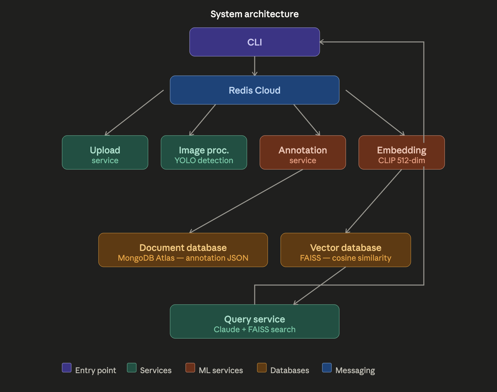
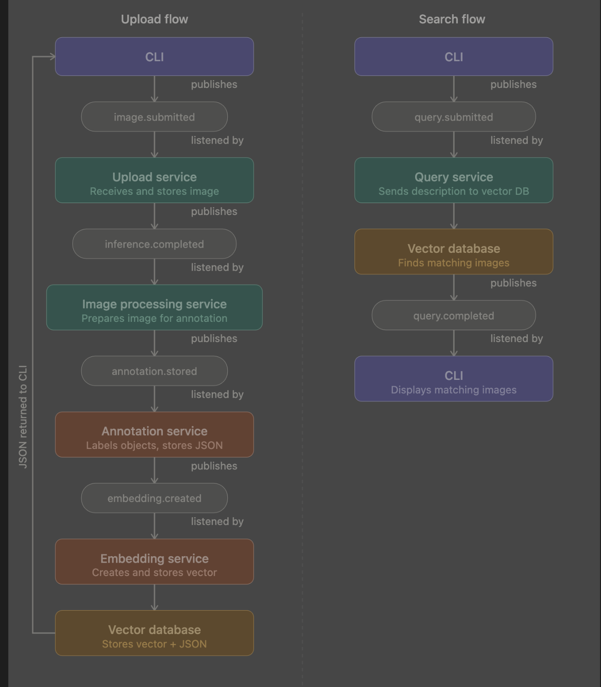

# Event-Driven Image Annotation and Retrieval System

EC530 Project 2 — Boston University
Lauren Rosales

---

## Overview

A modular event-driven pipeline for image annotation and retrieval. The system has two flows:

- **Upload flow** — batch upload images through the CLI, each image is tracked individually through processing, annotation, and embedding, stored in MongoDB and FAISS.
- **Search flow** — type a description through the CLI, query the vector database, and get matching images back.

No AI models are trained. Inference and embedding are simulated for now and will be swapped out with real implementations in week 2.




---

## Stack

- **Messaging** — Redis Cloud (pub/sub)
- **Document DB** — MongoDB Atlas (annotation JSON)
- **Vector DB** — FAISS (embeddings) test

---

## Project Structure

```
Event-driven/
├── Services/
│   ├── cli_service/
│   ├── upload_service/
│   ├── image_processing_service/
│   ├── annotation_service/
│   ├── embedding_service/
│   └── query_service/
├── databases/
│   ├── document_db/
│   └── vector_db/
├── Messaging/
│   ├── broker.py
│   ├── topics.py
│   └── event_generator.py
├── tests/
├── .env
└── README.md
```

---

## Setup

```bash
pip install redis pymongo faiss-cpu numpy python-dotenv
```

Create a `.env` file in the root:
```
REDIS_HOST=your-host
REDIS_PORT=your-port
REDIS_PASSWORD=your-password
MONGO_URI=your-mongo-uri
MONGO_DB_NAME=event_driven_db
```

---

## Running the pipeline

Open 5 terminals:

```bash
# Terminal 1
python3 -m Services.upload_service.upload_service

# Terminal 2
python3 -m Services.image_processing_service.image_processing_service

# Terminal 3
python3 -m Services.annotation_service.annotation_service

# Terminal 4
python3 -m Services.embedding_service.embedding_service

# Terminal 5 — upload images
python3 -m Services.cli_service.cli upload images/cat.jpg images/dog.jpg

# Terminal 5 — search
python3 -m Services.cli_service.cli search "a cat with a halloween costume"
```

---

## Topics

| Topic | Description |
|---|---|
| `image.submitted` | CLI uploads image |
| `image.received` | Upload service confirms receipt |
| `image.validated` | File type confirmed valid |
| `image.invalid` | File type rejected |
| `image.processing` | Handed to image processing |
| `image.processing.complete` | Processing done |
| `annotation.storing` | Sent to annotation service |
| `annotation.stored` | Saved to MongoDB |
| `image.annotating` | Annotation in progress |
| `image.annotated` | Annotation complete |
| `embedding.processing` | Sent to embedding service |
| `embedding.complete` | Embedding generated |
| `vector.storing` | Sending to FAISS |
| `vector.stored` | Saved to FAISS |
| `query.submitted` | CLI submits search |
| `query.completed` | Results returned |

---

## Tests

```bash
python3 -m pytest tests/ -v
```

---

## What's simulated (week 2 will replace these)

- Image processing — returns fake metadata
- Annotation — returns hardcoded object labels
- Embedding — returns random 128-dim vector
- Vector search — returns random matches